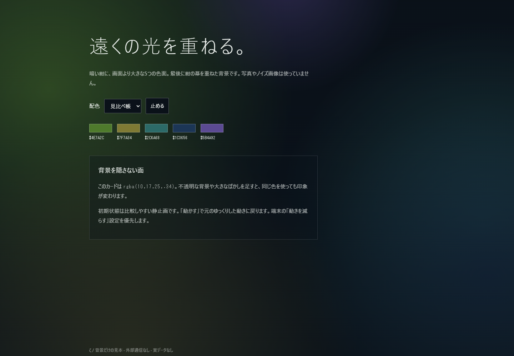

# 自宅版と同じ背景・質感を再現する

背景は画像ではなくCSSです。5つの放射状グラデーションと、その上に重ねる紺色の幕で作っています。ノイズ、紙のテクスチャ、写真、追加の `filter: blur()` は使いません。

まずこのフォルダをまとめて取得し、[background.html](background.html) をブラウザで開いてください。外部通信・ライブラリ・フォント読込なしで背景を確認できます。初期配色は「見比べ帳」、初期状態は静止です。配色と動きを切り替えられます。



## そのまま使う最小構成

[background.css](background.css) をHTMLと同じ場所へ置き、以下を使います。背景だけなら `zeta.js` は不要です。

```html
<!doctype html>
<html lang="ja" class="zeta-page" data-zeta-palette="compare">
<head>
  <meta charset="utf-8">
  <meta name="viewport" content="width=device-width,initial-scale=1">
  <link rel="stylesheet" href="background.css">
  <title>アプリ</title>
</head>
<body class="zeta-page">
  <div class="zeta-background" aria-hidden="true">
    <i></i><i></i><i></i><i></i><i></i>
  </div>
  <main class="zeta-content">
    <!-- 既存アプリの内容をここへ。大きな不透明背景を重ねない -->
  </main>
</body>
</html>
```

静止させる場合は背景のdivに `data-motion="still"` を付けます。動かす場合は外します。動作中でも端末の `prefers-reduced-motion` を尊重します。

背景はbody直下、内容は `.zeta-content` に置きます。背景の親に `transform` や `filter` を付けないでください。ページの重なりを `isolation:isolate` で閉じ、背景を0、内容を1の層に置いています。既存の `#zf` 方式と二重に使用しないでください。

## 配色を完全に合わせる

`data-zeta-palette` をhtml要素に指定します。以下は自宅版のCSSから取得した値です。数値版は [background-palettes.json](background-palettes.json)。

| 配色名 | 画面 | f1 | f2 | f3 | f4 | f5 |
|---|---|---|---|---|---|---|
| default | 共通 | #4E7A2C | #7F7A34 | #2C6A68 | #1C3656 | #6A3B26 |
| compare | 見比べ帳 | #4E7A2C | #7F7A34 | #2C6A68 | #1C3656 | #5B4A92 |
| notes | 記録 | #5B4A92 | #4E7A2C | #2C6A68 | #1F3558 | #7A5A2A |
| lyrics | 作詞 | #2F7A5A | #6E7A34 | #2C6A78 | #1C3656 | #4A5A2A |
| usage | 利用量 | #2C5E7A | #4E6E3A | #2C6A68 | #1C3656 | #5A4A2E |
| tasks | タスク | #5B4A92 | #566E30 | #2C6A68 | #1F3558 | #6A4A2A |
| feed | フィード | #7A6232 | #56702E | #2C5E5E | #1C3656 | #6A3B26 |
| map | 地図 | #4E7A2C | #6E7A34 | #2C6A68 | #1C3656 | #5A4A2A |

色面の元の色は、画面で見える色そのものではありません。透明度、位置、重なり、最後の紺の幕がすべて効きます。色見本のHEX値を画面全体にそのまま塗ると、明るすぎる別の背景になります。

## 質感を決める値

- 最下層：`#0A1119`。
- 円の直径：順に `95 / 80 / 90 / 70 / 44vmax`。ピクセル固定やコンテナ幅基準に変えない。
- 円の中心から透明へ抜ける `radial-gradient(closest-side, …, transparent)`。境界が見える小さな円や線形グラデーションに置き換えない。
- 中心色の強さ：順に `85 / 80 / 80 / 90 / 55%`。`color-mix(in srgb, 色 …%, transparent)` を使う。
- 最後の幕：上から紺の不透明度 `.30` → 高さ60%で `.52` → 下端 `.70`。これを省くと強く明るい色になる。
- 動き：`46 / 58 / 52 / 64 / 40秒`。比較するときは両方を静止状態にする。
- カード：必要なら `rgba(10,17,25,.34)`。背景だけの見本では、同じ透明度のカードを用意している。

色面の寸法・座標・透明度・動きは既存の共通CSSと同じです。追加部品では重なり順だけを明示的にし、別アプリへ持ち込んだ際の負のz-indexによる隠れを避けています。既存の `zeta.css` / `zeta.js` は変更していません。

## 既存のzeta.css / zeta.jsを使っている場合

従来方式では `zeta.js` が `#zf` と5つのi要素を追加します。CSSだけコピーしても色面は出ません。JavaScriptを使わないなら同じマークアップをbody先頭へ置いてください。

```html
<div id="zf" aria-hidden="true"><i></i><i></i><i></i><i></i><i></i></div>
```

この方式で背景が消える場合、元のCSSは `z-index:-1` なので、既存アプリの重なり順や不透明な親背景を確認します。背景を独立させたい場合は、従来の `#zf` を外して上の `background.css` 方式へ置き換え、`zeta.js` の背景自動挿入部分も外します。図・入力・保存の処理は変えません。

## 再現できないときに確認する順番

1. `background.html` 単体で確認する。ここで見えれば、組込先のCSSやDOMとの干渉を調べる。
2. 配色名を合わせる。特に見比べ帳の5色目は共通色と異なる。
3. 背景のdivと5つのi要素があること、CSSが読めていることを確認する。
4. アプリ全体の不透明な背景、負のz-index、祖先のtransform、背景の二重挿入を確認する。
5. 比較する画面サイズと動きをそろえる。`vmax`なので縦横比が変わると色面の見え方も変わる。
6. ブラウザで `CSS.supports('color', 'color-mix(in srgb, red 85%, transparent)')` を確認する。未対応なら対応ブラウザで比較する。

画面の色温度・HDR・ディスプレイ差まで、このCSSが補正するわけではありません。まず配色と合成が同じかをそろえます。会社側の実装は未確認なので、原因を1つに断定していません。

## 会社側のAIへ渡す文

```text
design/zeta/BACKGROUND.md を読み、background.html を背景の基準として使ってください。
背景は画像ではなく5層のCSSグラデーションです。background.css と明示した5つのi要素を使用し、配色はまず compare（見比べ帳）に合わせてください。
元の寸法・位置・透明度・紺の重ね合わせを保ち、独自のノイズ画像や追加ぼかしで近似しないでください。
背景だけを直し、既存の入力・保存・業務ロジックは変更しないでください。別の配色が必要なら同資料のアプリ別パレットを選んでください。
```
