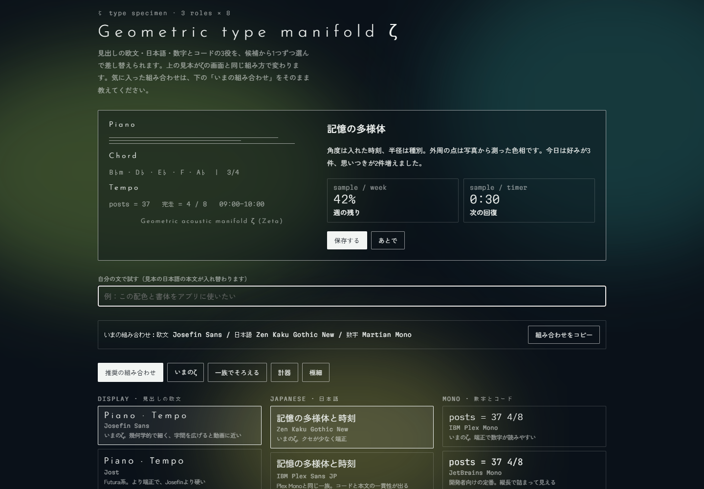

# 推奨：フォント見比べサイトの背景と文字

こちらを見た目の基準にしてください。[font-specimen.html](font-specimen.html) はフォント見比べサイトの元HTMLをもとに、公開用のサンプルへ整えたものです。書体候補の切り替え、文章の入力、組み合わせのコピーが使えます。

初期の組み合わせは **Josefin Sans / Zen Kaku Gothic New / Martian Mono**。元の見本の初期値はIBM Plex Monoでしたが、選択された組み合わせを初期表示にしています。サンプル内の数値や名前は架空です。



## 共通アプリ版との違い

| 要素 | このフォント見比べ版 | アプリ共通版（BACKGROUND.md） |
|---|---|---|
| 色面 | 3つの楕円を80pxぼかす | 5つの放射状グラデーション |
| 色 | 苔 #5E7A3A・青緑 #1F5A5A・オリーブ #7A7A3A | アプリごとの5色 |
| 濃さ | 各色面のopacity .55 | 各グラデーションの中心色の透明度 |
| 紺の幕 | 追加しない | 最前面に紺のグラデーションを重ねる |
| パネル | 紺 .42、背景ぼかし6px | 半透明の紺、カードのぼかしは原則なし |

この2つを混ぜると別の印象になります。フォント見比べサイトの質感には **3色＋80pxぼかし** を使ってください。どちらも写真や背景画像をダウンロードする方式ではありません。

## 背景だけ移す

[font-background.css](font-background.css) を読み込み、bodyの直下に以下を置きます。既存の5色の背景は取り除き、二重に重ねないでください。

```html
<link rel="stylesheet" href="font-background.css">
<div class="blob b1" aria-hidden="true"></div>
<div class="blob b2" aria-hidden="true"></div>
<div class="blob b3" aria-hidden="true"></div>
<main class="font-content">
  <section class="font-panel">アプリの内容</section>
</main>
```

| 色面 | 幅 × 高さ | 位置 |
|---|---|---|
| 苔 | 60vw × 50vh | left -10vw / top 10vh |
| 青緑 | 50vw × 60vh | right -12vw / top -8vh |
| オリーブ | 40vw × 40vh | left 30vw / bottom -10vh |

全て `position:fixed; border-radius:50%; filter:blur(80px); opacity:.55`。動きは26・32・38秒で、移動4vw/3vh・拡大1.08。端末が動きを減らす設定なら停止します。色面の親にtransformやfilterを付けないでください。

## 文字とパネル

- 地：`#0A1119`、文字：`#F2F5F3`、補助文字：`rgba(242,245,243,.62)`。
- 欧文見出し：Josefin Sans、weight 300、字間 `.28em`。文字だけ置き換えても、太さ・字間が違うと同じ見た目になりません。
- 日本語：Zen Kaku Gothic New、本文400・見出し500。
- 数字：Martian Mono、weight 200。
- パネル：`rgba(10,17,25,.42)`、`backdrop-filter:blur(6px)`、枠1pxの白 `.55`、角丸2px。
- 細い枠：白 `.18`。大きな影を追加しない。

フォント見本はGoogle Fontsへ接続します。会社のネットワークでフォント配信が制限される場合は、同じ書体を端末へインストールするか、各ライセンスに従ってアプリへ同梱してください。背景のCSS自体は外部通信不要です。

## 会社側のAIへ貼る指示

```text
design/zeta/FONT-SPECIMEN.md と font-specimen.html を読んでください。今回の見た目の基準はフォント見比べ版です。
背景はfont-background.cssの3色の楕円、blur(80px)、opacity .55をそのまま使ってください。5色のアプリ共通背景や追加の紺の幕を混ぜないでください。
欧文はJosefin Sans 300・字間 .28em、日本語はZen Kaku Gothic New、数字はMartian Mono 200。パネルは紺 .42・背景ぼかし6px・白線 .55を使ってください。
既存の入力・保存・業務ロジックは保ち、背景と文字と面の見た目を合わせてください。
```
