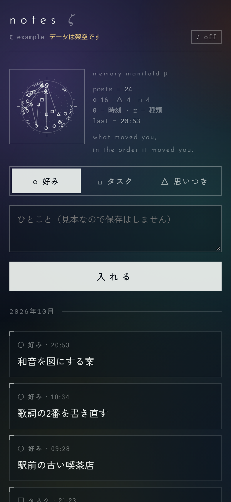

# ζ（ゼータ）— 幾何と音の UI デザイン

暗い紺の地に、大きくぼかした色面と、細い白線の幾何図形を置く UI の作り方です。
個人用の小さな Web アプリ（入力・一覧・計器）6つを、一晩でこの見た目にそろえたときの知見をまとめました。
Claude Code に「この見た目で作って」と頼むときの指示書としても使えます。

**おすすめの再現基準：フォント見比べ版** → [FONT-SPECIMEN.md](FONT-SPECIMEN.md)・[動くフォント見本](font-specimen.html)。3色を80pxぼかした背景と、Josefin Sans / Zen Kaku Gothic New / Martian Monoの組み合わせを収録。下記の従来の5色版とは背景の作り方が異なります。



- 見本：[example.html](example.html)（ダウンロードしてブラウザで開くと動きます。データは架空）
- 部品：[zeta.css](zeta.css)・[zeta.js](zeta.js)（どの画面にも後から足せる）
- **背景の質感や色を別環境で再現する**：[BACKGROUND.md](BACKGROUND.md)。背景だけの動く見本 [background.html](background.html)、外部依存のない [background.css](background.css)、自宅版の6アプリ・見比べ帳の配色を収録。背景は画像ではなくCSSの色面です。

## 出典と着想

- **Raf0x00「3/4拍子音楽の幾何学的解釈 (p5.js)」**（X の投稿・[@raf0x00](https://x.com/raf0x00)、#DTM #Aviutl #p5js）
  - 画面の構成：中央に正方形の枠、その中で和音を点と線の多角形として描く。左に楽器ごとの小さな記録（Piano / Chord / Tempo）、右に円形の可視化・波形・スペクトラム
  - 地：暗い紺に、緑・オリーブ・青緑の色面を強くぼかしたもの
  - 文字：字間の広い細い欧文、詩のような英文の引用（“Quoted from …”）、飾りとして置かれたコードの断片
  - **見た目をそのまま写すのではなく、「音楽を数学・幾何として見せる」という一貫性を、自分のデータで作り直すこと**を目標にした
- 描画のやり方は [p5.js](https://p5js.org/) の作品を参考にしたが、この部品は素の Canvas 2D API で書いている（ライブラリ不要）
- 書体：[Josefin Sans](https://fonts.google.com/specimen/Josefin+Sans)・[Zen Kaku Gothic New](https://fonts.google.com/specimen/Zen+Kaku+Gothic+New)・[IBM Plex Mono](https://fonts.google.com/specimen/IBM+Plex+Mono)（いずれも Google Fonts・OFL）

出典の動画や画像は、このリポジトリには入れていません。見るときは元の投稿へ。

## 原則（これだけ守れば ζ に見える）

1. **地は暗い紺 `#0A1119` の1色。** その上に、彩度を抑えた色面を 4〜5 個、画面より大きな円のぼかしとして重ね、ゆっくり動かす。最後に上から薄い紺を一枚かけて「遠くの光」にする
2. **線は細い白だけ。** 太さ 1px、白の不透明度で強弱をつける（.15 / .32 / .62）。色で区別しない
3. **角は立てる（半径 2px）。影は使わない。** 面は半透明の紺（`rgba(10,17,25,.34)`）
4. **書体は3役。** 欧文の見出し＝Josefin Sans 300 を字間 .22〜.34em／日本語＝Zen Kaku Gothic New／数字とコード＝IBM Plex Mono 300
5. **計器の枠＝正方形＋角の印。** 中央の図は必ず正方形の枠の中に置き、左上と右下に短い線を足す
6. **飾りのコードには本物の値だけを書く。** 例：`posts = 37`、`(c = 0; c < 6; c++) // 観点`。嘘の数字を飾りにすると、見た目は同じでも信用を失う
7. **図はデータから作る。** 角度・半径・線のつなぎ方に、それぞれ意味のある量を割り当てる（下の「図の作り方」）
8. **押せるものは2種類だけ。** 白い線の枠（通常）と、白い面に紺の文字（選択中・主操作）
9. **意味の色（警告・失敗・成功）は残すが、彩度を落とす。** 例：`#E6C77E` `#E89A8E` `#9FD3B0`
10. **絵文字は使わない。** 幾何記号に置き換える（○ □ △ ⌖ ◷）。種類の区別も色ではなく形で

## 色の決め方

| 役 | 値 |
|---|---|
| 地 | `#0A1119` |
| 文字 | `#EEF2EF`（不透明度 1 / .70 / .46 / .28 で4段） |
| 線 | `rgba(238,242,239, .15 / .32 / .62)` |
| 色面（既定） | 苔 `#4E7A2C`・オリーブ `#7F7A34`・青緑 `#2C6A68`・紺 `#1C3656`・錆 `#6A3B26` |
| 色面の差し替え例 | 藤紫 `#5B4A92`／真鍮 `#7A6232`。**アプリごとに1色だけ差し替えると、同じ世界観のまま見分けがつく** |

単一の暗いテーマで通す（明るいテーマは作らない）と決めた。その代わり、背景と全部の色を明示して、表示する側のテーマに左右されないようにする。

## 図の作り方（データ → 幾何）

動画の「和音を点と線で描く」を、自分のデータに置き換える。**どの量をどの軸に割り当てたかを、図の横に `zcode` で書く**。

| 図 | 割り当て | 使いどころ |
|---|---|---|
| 記憶の多様体 | 角度＝記録した時刻（真上が0時・24時間で1周）、半径＝種類、線＝記録した順につなぐ、外周の点の群れ＝写真の色相 | メモ・投稿・ログ |
| 多角形 | 頂点＝分類（6つなら六角形）、点＝各項目（中心から外へ）、線＝項目から出所へ | 知識・技法・タグ |
| 円周の進捗 | 円周の点＝タスク、塗り＝完了、線＝完了した順 | タスク・チェックリスト |
| Tempo の線 | 横軸＝日、縦に積んだ点＝その日の件数、輪＝印を付けたもの | フィード・日次の記録 |
| 丸い計器 | 細い円弧＝使用率（conic-gradient＋mask で 2.5px の輪） | 上限・残量 |
| スペクトル | 細い縦線の束＋折れ線＝日ごとの量 | 使用量・アクセス数 |

描き方のコツ：
- 線を引くアニメーションは最初の 1.6 秒だけ（`p` を 0→1）。その後は点が ±0.7px 揺れる程度にとどめる
- 最新の1件だけ二重の輪で強調し、外側の輪を3秒周期で広げて消す
- 乱数は**データの id を種にする**（同じデータなら毎回同じ形になる）

## 音（任意）

動画の音を FFT で調べると、**B♭マイナー・ペンタトニック（B♭ D♭ E♭ F A♭）で重みの約95%**だった。半音を含まない音階なので、効果音にどの組み合わせで鳴らしても濁らない。

- 押す＝5音を順に1音、主操作＝3/4 の1小節（B♭→F→上の D♭）、開く＝2音
- 正弦波にごく弱い3倍音、立ち上がり 6ms、指数で減衰、短い遅延2本で薄い残響
- **既定は切。** 画面上の「♪ off」で入れ、端末に覚える。ブラウザは操作した後でしか音を出せない
- 音名の調べ方：`ffmpeg -i in.mp4 -vn -ac 1 -ar 22050 -f f32le clip.f32` → 0.25 秒ごとに FFT → 上位5ピークを音名にして重みを集計（Node だけで書ける）

自分の音楽や参照動画がある場合は、同じ手順でその曲の音階に差し替えると、ブランドの音になる。

## 既存のアプリに後から足す手順

作り直さず、**元の HTML の末尾に CSS と JS を足す**のがいちばん安全（入力・保存の処理を触らない）。

1. `zeta.css` を読み込む → 元の CSS 変数（`--bg` `--ink` `--line` など）を ζ の値に置き換える上書きを書く
2. 角丸・影・グラデーションの指定を `!important` で消す（元の値が後から効かないように）
3. `zeta.js` を読み込む → `Z.draw(canvas, scene)` で図を描く。図の置き場所は、**アプリが再描画しない場所**（`innerHTML` で作り直される要素の外）にする
4. 見出しの欧文の副題、種類の幾何記号は CSS の `::before` で足す（DOM を変えると元のスクリプトが壊れることがある）
5. 画面ごとに図を出し分けるときは、表示を切り替える要素の `hidden` を `MutationObserver` で見る

## 見比べ帳（旧と新を並べて採点する）

作り直したら、**元の画面は上書きせず、別の場所に新しい版を作る**。そのうえで、旧と新を並べて採点する1枚のページを用意すると、「良くなったか」を感想ではなく点で比べられる。

- 1アプリ1枠：名前、旧と新へのリンク、何を変えたか（3行）、観点ごとの採点、ひとこと欄
- 観点は5つに固定：**世界観がそろっているか／読みやすいか／迷わず押せるか／開くと気分が上がるか／速く使えるか**
- 採点は旧と新をそれぞれ 1〜5。旧は点線の枠、新は白い面で選ばれた状態を示す
- 平均を**五角形のレーダー**で重ねる（旧＝点線、新＝実線）。何が伸びて何が落ちたかが一目で分かる
- 点とひとことは保存して、作った人（人でも AI でも）が後から読めるようにする。次の手直しはそこから始める
- 新しい版には、画面の上に「試作・本番に届きません」の札を出す（取り違えて本番の入力をしないため）

## はまった所（再発防止つき）

| 症状 | 原因 | 対策 |
|---|---|---|
| スマホ幅で横にはみ出す | `grid-template-columns:repeat(3,1fr)` の `1fr` は中身の最小幅に引っ張られる。字間を広げたボタンが押し広げた | `repeat(3,minmax(0,1fr))` にする。字間を広げた要素は `white-space:nowrap` と組み合わせない |
| 図が際限なく大きくなり、画面が白くなる | canvas の CSS サイズを決めずに `ResizeObserver` で `canvas.width` を変えた → 寸法が変わる → また発火 | canvas は `position:absolute;inset:0;width:100%;height:100%` で親に固定。再計算は `requestAnimationFrame` で1回に間引く（`zeta.js` に実装済み） |
| 地図の点が古い色のまま描かれる | 描画スクリプトが CSS 変数を読む時点で、上書きの CSS がまだ読み込まれていなかった | 上書きの CSS を、**その描画スクリプトより前**に差す |
| iPhone でスクロールが重い | カード1枚ずつに `backdrop-filter` を掛けていた | 背景が滑らかなぼかしなら、カードのぼかしは見た目に効かない。ぼかしは固定の見出しと下のナビだけ |
| PC の Chrome でスマホ幅の画面写真が撮れない | headless でもウィンドウ幅に下限（約500px）があり、レイアウトが広いまま切り取られる | 393px の `iframe` を載せた枠ページを開いて撮る |
| 絵文字が浮く | 絵文字は色付きで、白線の世界と合わない | 幾何記号に置き換え、状態は塗り／白抜きで表す |
| スクロールする一覧の固定見出し（日付の目盛りなど）が、色を付けると暗く浮き、色を抜くと行が透けて重なる | `position:sticky` の帯に半透明の色を付けると、親のすりガラスと二重になる。色を抜くと下の行が透ける。**見た目の調整では解けない** | 見出しを**スクロールする枠の外**へ出す（構造を変える）。見出し側と一覧側の両方に `scrollbar-gutter:stable` を付け、スクロールバーの幅で列がずれないようにする |
| すりガラスのパネルの中で開く小窓（日付選び・絞り込み）が、次のパネルの下に潜る。小窓の `z-index` を上げても効かない | `backdrop-filter` は重なりの文脈を作る。小窓の `z-index` はパネルの中でしか効かない | 小窓ではなく、**小窓を持つパネルの側**に `z-index` を付ける |
| ボタンの中で Josefin Sans の文字だけが上寄りに見える | 書体の作り（字面の位置）によるもの | 高さをそろえたボタンは、上の余白を 4px にして中身を 2px 下げ、アイコンだけ `top:-2px` で戻す。これを既定値にする |

## タスクボードで使えた型

別の環境で、ローカルで開く HTML 1枚のタスクボード（入力欄＋期限つきのガント＋期限なしの一覧）を ζ で作り、実際に使えた形です。

- **背景の色面は、開くたびに位置と大きさをランダムに置く。** 色は3色に絞り（苔・青緑・オリーブ）、順番も混ぜる。毎回少し違う画面になり、飽きにくい。`prefers-reduced-motion` では動かさない
- **期限は1ボタン＋自作のカレンダーの小窓。** ボタンの文字は「Schedule」、選んだ後は `10/02 Fri` の形。同じ日をもう一度押すと外れる。ブラウザ標準の日付入力は見た目がそろわないので使わない
- **ガントの目盛りはスクロールする枠の外に置く**（上の「はまった所」）。今日の線は目盛りと一覧の両方に引く
- **一覧の行は1行に省略して、押すと全文。** 出所や相手待ちは全文の側にだけ出す
- **絞り込みは小さな札（チップ）とアイコンだけ。** 重要・期限超過・7日以内・相手待ちを隠す、を独立に切り替え、状態は端末に覚える
- **入力は Ctrl+Enter で登録、スクリーンショットは Ctrl+V かドラッグ。** 貼った画像には番号を振り、本文から「1枚目」と指せるようにする

## Claude Code に渡す指示（CLAUDE.md に貼れる形）

```markdown
## UI は ζ（幾何と音）でそろえる
- 地は #0A1119 の1色＋大きくぼかした色面（苔・オリーブ・青緑・紺・錆）。上から薄い紺を一枚
- 線は 1px の白だけ（不透明度 .15/.32/.62）。角は 2px、影なし。面は rgba(10,17,25,.34)
- 書体：見出しの欧文＝Josefin Sans 300（字間 .22〜.34em）／日本語＝Zen Kaku Gothic New／数字とコード＝IBM Plex Mono 300
- 中央の図は正方形の枠＋角の印。図はデータから作り、何を角度・半径・線に割り当てたかを横に等幅で書く
- 飾りのコードには本物の値だけを書く。嘘の数字を置かない
- 押せるものは「白い線の枠」と「白い面」の2種類。意味の色は彩度を落とす。絵文字は使わず幾何記号
- 既存の画面には、作り直さず末尾に上書きの CSS と JS を足す。元は上書きせず別の版を作り、旧と新を5観点（世界観・読みやすさ・押しやすさ・気分・速さ）で採点する見比べページを添える。参考：laerdomr リポジトリの design/zeta/README.md
```

## このやり方で作ったもの

個人用の 6 アプリ（記録の入力、作詞の技法集、利用量の計器、タスク、記事の流れ、地図）。どれも元の処理を変えずに、見た目だけをこの部品で上書きした。採点（世界観／読みやすさ／押しやすさ／気分／速さ）で旧と比べる途中です。
